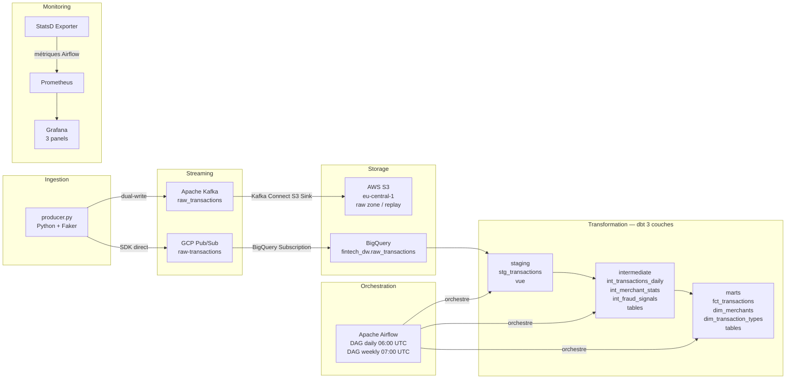
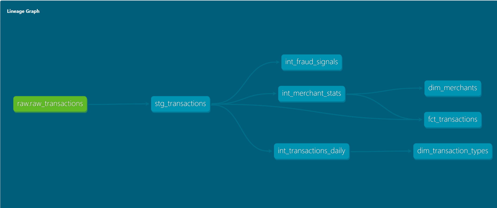
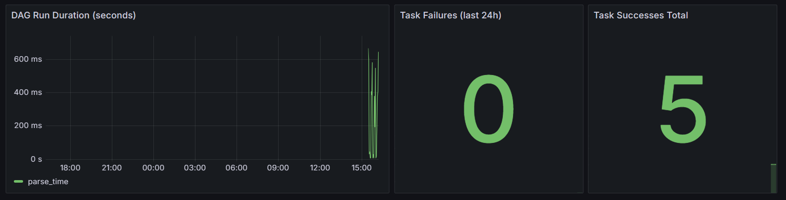

# Financial Transactions Analytics Platform


Pipeline de streaming financier de bout en bout : ingestion temps-réel via Kafka + Pub/Sub, stockage S3 + BigQuery, transformation dbt 3 couches, orchestration Airflow, monitoring Grafana.

---

## Architecture



---

## Stack technique

| Couche | Outil | Version |
|---|---|---|
| Génération données | Python + Faker | 3.11 |
| Streaming | Apache Kafka | confluentinc 7.5.0 |
| Sink S3 | Kafka Connect S3 Sink | 10.5.7 |
| Sink Pub/Sub | Python SDK dual-write | google-cloud-pubsub |
| Stockage objet | AWS S3 | eu-central-1 |
| Messaging | GCP Pub/Sub | — |
| Data Warehouse | BigQuery | GCP EU |
| Transformation | dbt-bigquery | 1.11.1 |
| Data quality | 28 tests dbt (natifs + dbt_utils) | — |
| Orchestration | Apache Airflow | 2.8.1 |
| CI/CD | GitHub Actions | — |
| Monitoring | Prometheus + Grafana | 2.51.2 / 10.4.2 |
| Metrics bridge | StatsD Exporter | 0.26.1 |

---

## Décisions d'architecture

**Dual-write Python** — le producer publie chaque transaction en parallèle vers Kafka ET Pub/Sub via SDK direct. Le Kafka Connect Pub/Sub Sink n'est pas disponible en self-hosted sur Confluent Hub.

**S3 comme raw zone** — Kafka Connect S3 Sink écrit en JSON partitionné par heure (`partition.duration.ms=3600000`), flush toutes les 100 transactions. Permet le replay en cas d'incident.

**BigQuery Subscription native** — Pub/Sub → BigQuery via subscription GCP sans Dataflow ni code custom. Latence < 60s end-to-end.

**dbt materializations** — staging en vues (zéro coût stockage), intermediate et marts en tables (performance requêtes).

**Test latency avec clause `where`** — le test `pipeline_latency_seconds` est restreint aux 24 dernières heures pour ne tester que le batch en cours et non les données historiques de backfill.

---

## Prérequis

- Docker Desktop ≥ 4.x
- Compte GCP avec BigQuery + Pub/Sub activés
- Compte AWS avec accès S3
- Clé de service GCP (JSON)

---

## Lancement

### 1. Clone et configuration

```bash
git clone https://github.com/sarahbouden/financial-transactions-platform.git
cd financial-transactions-platform
```

Crée un fichier `.env` à la racine :

```env
AWS_ACCESS_KEY_ID=your_aws_access_key
AWS_SECRET_ACCESS_KEY=your_aws_secret_key
```

Place la clé de service GCP :

```
gcp/service-account.json   ← ton fichier JSON GCP
```

### 2. Démarrage complet

```bash
docker compose up -d
```

Attends ~60 secondes que tous les containers soient healthy :

```bash
docker compose ps
```

### 3. Vérification des services

| Service | URL |
|---|---|
| Airflow UI | http://localhost:8080 (admin/admin) |
| Grafana | http://localhost:3000 (admin/admin) |
| Prometheus | http://localhost:9090 |
| Kafka Connect | http://localhost:8083 |

### 4. Initialisation Kafka Connect S3 Sink

```bash
curl -X POST http://localhost:8083/connectors \
  -H "Content-Type: application/json" \
  -d @kafka/s3-sink-connector.json
```

### 5. Démarrage du producer

Le producer démarre automatiquement avec `docker compose up`. Vérifie les logs :

```bash
docker compose logs -f producer
```

### 6. Trigger manuel des DAGs

Airflow UI → `daily_pipeline` → **Trigger DAG ▶**

---

## Modèles dbt

```
raw.raw_transactions
    └── stg_transactions (vue)
            ├── int_fraud_signals (table)
            ├── int_merchant_stats (table) ──→ dim_merchants (table)
            └── int_transactions_daily (table) ──→ fct_transactions (table)
                                                 └── dim_transaction_types (table)
```

### dbt Lineage Graph



### Tests de data quality

28 tests couvrant :
- Unicité et non-nullité des clés primaires
- Valeurs acceptées (`transaction_type`, `status`)
- Montants positifs (test générique custom)
- Latence pipeline < 3600s sur les données des dernières 24h

```bash
# Lancer les tests manuellement
cd dbt/fintech_dw
dbt test --profiles-dir .
```

---

## Orchestration Airflow

### DAG 1 — `daily_pipeline` (quotidien 06:00 UTC)

```
check_bq_freshness >> dbt_run_staging >> dbt_run_intermediate >> dbt_run_marts >> dbt_test
```

### DAG 2 — `weekly_maintenance` (lundi 07:00 UTC)

```
dbt_test_full >> check_row_counts >> dbt_docs_generate
```

---

## Monitoring Grafana

3 panels sur le dashboard **Airflow — Financial Transactions Platform** :

| Panel | Métrique | Type |
|---|---|---|
| DAG Run Duration | `airflow_dag_processing_total_parse_time` | Time series |
| Task Failures (last 24h) | `airflow_ti_start - on(instance) airflow_ti_successes` | Stat |
| Task Successes Total | `airflow_ti_successes` | Stat |



---

## CI/CD

GitHub Actions déclenché sur chaque PR modifiant `dbt/**` :

```
checkout → setup-python → dbt deps → dbt compile → dbt test
```

---

## Releases

| Tag | Contenu |
|---|---|
| `v1.0-ingestion` | Producer Kafka + Pub/Sub + S3 Sink + BigQuery |
| `v2.0-dbt` | Transformation dbt 3 couches + 28 tests |
| `v3.0-orchestration` | Airflow 2 DAGs + GitHub Actions CI |
| `v4.0-monitoring` | Prometheus + Grafana + StatsD Exporter |
